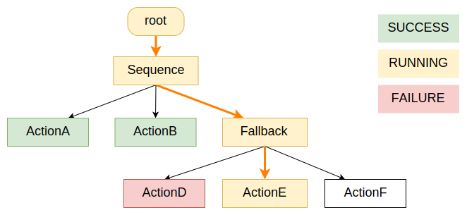

# 异步动作

在设计响应式行为树时，理解两个主要概念很重要：

- 我们所说的 **"异步"** 动作与 **"同步"** 动作的区别。
- 在BT.CPP上下文中 **并发** 与 **并行** 的区别。

## 并发 vs 并行

如果你谷歌这些词，你会读到许多关于这个话题的好文章。

> [!NOTE]
> **并发** 是指两个或多个任务可以在重叠的时间段内开始、运行和完成。它不一定意味着它们会在同一时刻都在运行。
>
> **并行** 是指任务在不同线程中同时运行，例如在多核处理器上。

BT.CPP **并发** 执行所有节点。换句话说：

- 树执行引擎是 **单线程的** 。
- 所有`tick()`方法 **顺序** 执行。
- 如果任何`tick()`方法是阻塞的，整个执行流将被阻塞。

我们通过"并发"和异步执行实现响应式行为。

换句话说，需要长时间执行的动作应尽快返回状态RUNNING。

这告诉树执行器动作已启动，需要更多时间才能返回状态SUCCESS或FAILURE。我们需要再次触发该节点以了解状态是否改变（轮询）。

异步节点可以将这个长时间执行委托给另一个进程（使用进程间通信）或另一个线程。

## 异步 vs 同步

通常，异步节点是：

- 触发时可能返回RUNNING而不是SUCCESS或FAILURE。
- 当调用`halt()`方法时，可以尽快停止。

通常， **halt()** 方法必须由开发者实现。

当你的树执行返回RUNNING的异步动作时，该状态通常 **向后传播** ，整个树被认为处于RUNNING状态。

在下面的示例中，"ActionE"是异步且RUNNING的；当节点处于RUNNING时，通常其父节点也返回RUNNING。



让我们考虑一个简单的"SleepNode"。一个良好的起点模板是 __StatefulActionNode__ 。

``` cpp

using namespace std::chrono;

// 使用StatefulActionNode作为基类的异步节点示例
class SleepNode : public BT::StatefulActionNode
{
  public:
    SleepNode(const std::string& name, const BT::NodeConfig& config)
      : BT::StatefulActionNode(name, config)
    {}

    static BT::PortsList providedPorts()
    {
      // 我们想要休眠的毫秒数
      return{ BT::InputPort<int>("msec") };
    }

    NodeStatus onStart() override
    {
      int msec = 0;
      getInput("msec", msec);

      if( msec <= 0 ) {
        // 不需要进入RUNNING状态
        return NodeStatus::SUCCESS;
      }
      else {
        // 一旦达到截止时间，我们将返回SUCCESS。
        deadline_ = system_clock::now() + milliseconds(msec);
        return NodeStatus::RUNNING;
      }
    }

    /// 在RUNNING状态下由动作调用的方法。
    NodeStatus onRunning() override
    {
      if ( system_clock::now() >= deadline_ ) {
        return NodeStatus::SUCCESS;
      }
      else {
        return NodeStatus::RUNNING;
      }
    }

    void onHalted() override
    {
      // 这里没什么可做的...
      std::cout << "SleepNode interrupted" << std::endl;
    }

  private:
    system_clock::time_point deadline_;
};
```

在上面的代码中：

1. 当SleepNode第一次被触发时，执行`onStart()`方法。如果休眠时间为0，这可能立即返回SUCCESS，否则返回RUNNING。
2. 我们应该继续在循环中触发树。这将调用`onRunning()`方法，该方法可能再次返回RUNNING，或最终返回SUCCESS。
3. 另一个节点可能触发`halt()`信号。在这种情况下，调用`onHalted()`方法。

## 避免阻塞树的执行

实现`SleepNode`的 **错误** 方式是这样的：

```cpp
// 这是节点的同步版本。可能不是我们想要的。
class BadSleepNode : public BT::ActionNodeBase
{
  public:
    BadSleepNode(const std::string& name, const BT::NodeConfig& config)
      : BT::ActionNodeBase(name, config)
    {}

    static BT::PortsList providedPorts()
    {
      return{ BT::InputPort<int>("msec") };
    }

    NodeStatus tick() override
    {  
      int msec = 0;
      getInput("msec", msec);
      // 这个阻塞函数将冻结整个树 :(
      std::this_thread::sleep_for( milliseconds(msec) );
      return NodeStatus::SUCCESS;
     }

    void halt() override
    {
      // 没有人可以调用这个方法，因为我冻结了树。
      // 即使这个方法可以被执行，我也无法
      // 中断std::this_thread::sleep_for()
    }
};
```

## 多线程的问题

在这个库的早期版本（版本1.x）中，生成新线程似乎是构建异步动作的好解决方案。

这是一个坏主意，原因如下：

- 以线程安全的方式访问黑板更难（稍后详细介绍）。
- 你可能不需要。
- 人们认为这会神奇地使动作"异步"，但他们忘记了当`halt()`方法被调用时， **他们仍然有责任** 以某种方式 **快速** 停止该线程。

因此，通常不鼓励用户使用`BT::ThreadedAction`作为基类。让我们再看一下SleepNode。

```cpp
// 这将生成自己的线程。但在中止时仍然有问题
class BadSleepNode : public BT::ThreadedAction
{
  public:
    BadSleepNode(const std::string& name, const BT::NodeConfig& config)
      : BT::ActionNodeBase(name, config)
    {}

    static BT::PortsList providedPorts()
    {
      return{ BT::InputPort<int>("msec") };
    }

    NodeStatus tick() override
    {  
      // 这段代码在自己的线程中运行，因此树仍在运行。
      // 这看起来不错，但线程仍然无法中止
      int msec = 0;
      getInput("msec", msec);
      std::this_thread::sleep_for( std::chrono::milliseconds(msec) );
      return NodeStatus::SUCCESS;
    }
    // halt()方法无法杀死生成的线程 :(
};
```

正确的版本应该是：

```cpp
// 我将在这里创建自己的线程，没有好的理由
class ThreadedSleepNode : public BT::ThreadedAction
{
  public:
    ThreadedSleepNode(const std::string& name, const BT::NodeConfig& config)
      : BT::ActionNodeBase(name, config)
    {}

    static BT::PortsList providedPorts()
    {
      return{ BT::InputPort<int>("msec") };
    }

    NodeStatus tick() override
    {  
      // 这段代码在自己的线程中运行，因此树仍在运行。
      int msec = 0;
      getInput("msec", msec);

      using namespace std::chrono;
      const auto deadline = system_clock::now() + milliseconds(msec);

      // 定期检查isHaltRequested() 
      // 并且只休眠一小段时间（1毫秒）
      while( !isHaltRequested() && system_clock::now() < deadline )
      {
        std::this_thread::sleep_for( std::chrono::milliseconds(1) );
      }
      return NodeStatus::SUCCESS;
    }

    // halt()方法将设置isHaltRequested()为true 
    // 并停止生成线程中的while循环。
};
```

如你所见，这比我们最初使用`BT::StatefulActionNode`实现的版本更复杂。这种模式在某些情况下仍然有用，但你必须记住，引入多线程会使事情变得更复杂， **默认情况下应避免** 。

## 高级示例：客户端/服务器通信

通常，使用BT.CPP的人在不同的进程中执行实际任务。

在ROS中，典型（且推荐）的方法是使用[ActionLib](http://wiki.ros.org/actionlib)。

ActionLib提供了我们正确实现异步行为所需的确切API：

1. 启动动作的非阻塞函数。
2. 监视动作当前执行状态的方法。
3. 检索结果或错误消息的方法。
4. 抢占/中止正在执行的动作的能力。

这些操作都不是"阻塞的"，因此我们不需要生成自己的线程。

更一般地说，我们可以假设开发者有自己的进程间通信，在BT执行器和实际服务提供者之间存在客户端/服务器关系。