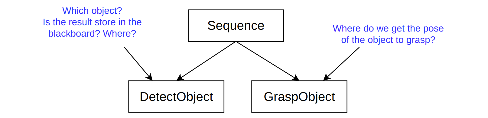
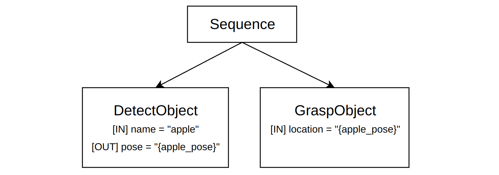

# 端口 vs 黑板

**BT.CPP** 是（据我们所知）唯一引入 **输入/输出端口** 概念的行为树实现，作为 **黑板** 的替代方案。

更具体地说，端口是一个接口，为黑板添加了一层间接性和额外的语义。

要理解为什么推荐使用端口而 **不鼓励** 直接使用黑板，我们首先应该理解BehaviorTree.CPP的一些核心原则。

## BT.CPP的目标

### 模型驱动开发

本文的目的不是解释什么是模型驱动开发。但简而言之，我们想要构建节点的"模型"，即某种元信息，告诉我们节点如何与树的其余部分交互。

模型对开发者（自我文档化）和外部工具都很重要，例如可视化编辑器（Groot2是一个显著的例子）或静态分析器。

我们相信 **节点之间数据流的描述必须是模型的一部分** 。此外，我们想要清楚地表达黑板条目是被写入（输出）、读取（输入）还是两者兼有。

考虑这个示例：



在其他实现中（或者如果有人不适当地使用这个库...），了解这两个节点是否通信和相互依赖的唯一方法是：

- **检查代码** ：我们想要避免的事情。
- 或 **阅读文档** ：但不能保证文档准确且最新。

相反，如果输入/输出端口是模型的一部分，节点的意图及其与其他节点的关系变得更加明确：



### 节点可组合性和子树作用域

理想情况下，我们希望提供一个平台，允许行为设计师构建由不同供应商/用户实现的树（即"组合节点"）。

但是当直接使用黑板时，名称冲突将立即成为问题。

考虑常见名称，如`goal`、`results`、`target`、`value`等。

例如，节点 **GraspObject** 和 **MoveBase** 可能由不同的人开发，它们都从黑板读取条目`target`。不幸的是，它们有不同的含义，类型本身也不同：前者期望3D位姿，而后者期望2D位姿。

**端口** 提供了一层间接性，也称为"重映射"，如[教程2](../tutorial-basics/tutorial_02_basic_ports.md)中解释的。

这意味着，无论定义端口时使用什么名称（该名称"硬编码"到你的C++实现中），你总是可以在XML中将其"重映射"到不同的黑板条目，而无需修改源代码。

子树重映射也是如此，如[教程6](../tutorial-basics/tutorial_06_subtree_ports.md)中解释的。黑板作为全局变量的美化映射，扩展性很差。这就是为什么在编程中全局变量是不好的！

端口重映射为这个问题提供了解决方案。

## 总结：永远不要直接使用黑板

你应该这样做：

```c++
// tick()中的示例代码
getInput("goal", goal);
setOutput("result", result);
```

并尽可能避免这样做：

```c++
// tick()中的示例代码
config().blackboard->get("goal", goal);
config().blackboard->set("result", result);
```

这两种代码在技术上可能都有效，但后者（直接访问黑板）被认为是坏习惯， **强烈不鼓励** ：

第二个版本（即直接访问黑板）的问题：

1. 名称"goal"和"result"是硬编码的。要更改它们，必须重新编译应用程序。而端口可以在运行时重映射，只需修改XML。

2. 了解节点是否读取或写入一个或多个黑板条目的唯一方法是检查代码。最新的文档是一种解决方案，但端口模型是自我文档化的。

3. `BehaviorTreeFactory`不知道正在访问哪些黑板条目。相反，当使用端口时，我们能够内省端口如何相互通信，并在部署时检查连接是否正确完成。

4. 使用子树时可能无法按预期工作。

5. 模板特化`convertFromString()`将无法正确工作。