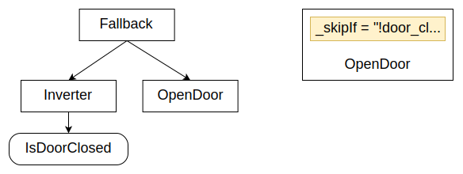
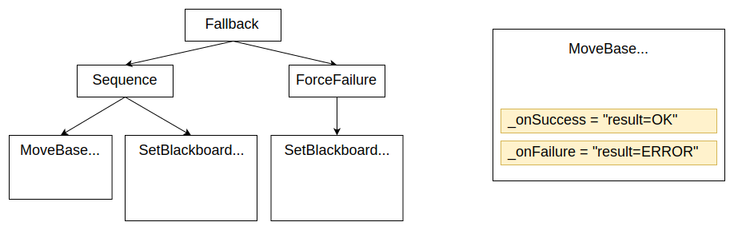
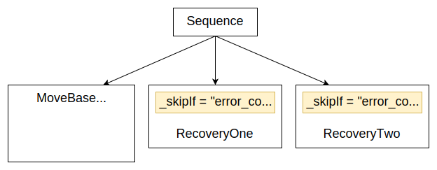
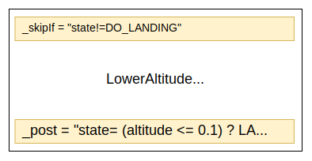

# 前置和后置条件

利用[上一个教程](guides/scripting.md)中介绍的脚本语言的力量，BT.CPP 4.x引入了前置和后置条件的概念，即可以在节点的实际__tick()__之前或之后运行的脚本。

前置和后置条件由__所有__节点支持，不需要在C++代码中进行任何修改。

:::caution
脚本的目标__不是__编写复杂的代码，而是提高树的可读性，并在非常简单的用例中减少对自定义C++节点的需求。

如果你的脚本变得太长，你可能需要重新考虑使用它们的决定。
:::

## 前置条件

| 名称 | 描述 | 何时评估 |
|-------------|---------|----------------|
| **_skipIf**    |  如果条件为true，跳过此节点的执行   | 仅在IDLE时（一次） |
| **_failureIf** |  如果条件为true，跳过并返回FAILURE | 仅在IDLE时（一次） |
| **_successIf** |  如果条件为true，跳过并返回SUCCESS | 仅在IDLE时（一次） |
| **_while**     |  如果在IDLE时为false，跳过。如果在RUNNING时为false，中止节点并返回SKIPPED。 | IDLE和RUNNING（每次触发） |

:::caution 重要：一次性 vs 持续评估
**`_skipIf`、`_failureIf`和`_successIf`仅在节点从IDLE转换到另一个状态时评估一次**。当节点处于RUNNING时，它们**不会重新评估**。

只有**`_while`**在每次触发时检查，包括节点正在运行时。

如果你需要在每次触发时重新评估条件，请使用`<Precondition>`装饰器节点和`else="RUNNING"`，而不是这些属性。
:::

:::note 评估顺序
前置条件按此顺序评估：`_failureIf` -> `_successIf` -> `_skipIf` -> `_while`。第一个满足的条件将决定结果。
:::

### 示例

在之前的教程中，我们看到了如何使用回退在树中构建if-then-else逻辑。

新语法更加紧凑：



以前的方法：

``` xml
<Fallback>
    <Inverter>
        <IsDoorClosed/>
    </Inverter>
    <OpenDoor/>
</Fallback>
```

如果我们可以将布尔值存储在名为`door_closed`的条目中，而不是使用自定义条件节点__IsDoorOpen__，XML可以重写为：

``` xml
<OpenDoor _skipIf="!door_closed"/>
```

### 使用`<Precondition>`进行每次触发评估

当你需要在**每次触发**时检查条件（不仅仅是节点开始时），请使用`<Precondition>`装饰器节点而不是内联属性。

这在**ReactiveSequence**或**ReactiveFallback**中特别有用，你希望每次触发运行中的子节点时重新评估条件：

``` xml
<!-- 这在每次触发时检查条件 -->
<Precondition if="battery_ok" else="RUNNING">
    <MoveToGoal/>
</Precondition>
```

使用`else="RUNNING"`，如果条件在子节点运行时变为false，装饰器返回RUNNING（保持树活动）而不是立即返回FAILURE或SKIPPED。

与内联属性比较：

``` xml
<!-- 这仅在MoveToGoal开始时检查条件 -->
<MoveToGoal _successIf="battery_ok"/>
```

内联的`_successIf`仅在`MoveToGoal`从IDLE转换时评估一次。如果`battery_ok`在`MoveToGoal`运行时改变，该改变被忽略。

## 后置条件

| 名称 | 描述 |
|-------------|---------|
| **_onSuccess** | 如果节点返回SUCCESS，执行此脚本 |
| **_onFailure** | 如果节点返回FAILURE，执行此脚本  |
| **_post**      | 如果节点返回SUCCESS或FAILURE，执行此脚本 |
| **_onHalted**  | 如果RUNNING节点被中止，执行的脚本 |

### 示例

在[关于子树的教程](tutorial-basics/tutorial_06_subtree_ports.md)中，我们看到了如何根据__MoveBase__的结果写入特定的黑板变量。

在左侧，你可以看到这个逻辑如何在BT.CPP 3.x中实现，以及使用后置条件代替是多么简单。此外，新语法支持**枚举**。



以前的版本：

``` xml
<Fallback>
    <Sequence>
        <MoveBase  goal="{target}"/>
        <SetBlackboard output_key="result" value="0" />
    </Sequence>
    <ForceFailure>
        <SetBlackboard output_key="result" value="-1" />
    </ForceFailure>
</Fallback>
```

新实现：

``` xml
<MoveBase goal="{target}" 
          _onSuccess="result:=OK"
          _onFailure="result:=ERROR"/>
```

# 设计模式：错误代码

与状态机相比，行为树可能难以处理的领域之一是在那些应该根据动作结果执行不同策略的模式中。

由于BT仅限于SUCCESS和FAILURE，这可能不直观。

一个解决方案是将__结果/错误代码__存储在黑板中，但在3.X版本中这很繁琐。

前置条件可以帮助我们实现更可读的代码，如下所示：



在上面的树中，我们向__MoveBase__添加了一个输出端口__return__，并根据`error_code`的值有条件地采用Sequence的第二或第三个分支。

# 设计模式：状态和声明式树

即使行为树的承诺是将我们从状态的暴政中解放出来，但事实是有时没有状态很难推理我们的应用程序。

使用状态可以使我们的树更容易。例如，只有当机器人（或子系统）处于特定状态时，我们才能采用树的某个分支。

考虑这个节点及其前置/后置条件：



只有当状态等于**DO_LANDING**时，此节点才会执行，并且一旦`altitude`的值足够小，状态将更改为**LANDED**。

注意DO_LANDING和LANDED是枚举，不是字符串。

:::tip
这种模式的一个令人惊讶的副作用是，我们使节点更加__声明式__，即更容易将此特定节点/子树移动到树的不同部分。
:::