# 关于

## 关于这个库

这个 __C++__ 库提供了一个创建 **行为树** 的框架。
它被设计为灵活、易用且快速。

即使我们的主要用例是 __机器人技术__ ，你也可以使用这个库来构建 __游戏AI__ ，或者在你的应用中替换有限状态机。

与其他实现相比， __BehaviorTree.CPP__ 具有许多有趣的功能：

- 它将 __异步动作__ （即非阻塞例程）作为一等公民。
- 树在运行时使用 __解释型语言__ （基于XML）创建。
- 它包含一个 __日志记录/性能分析__ 基础设施，允许用户可视化、记录、重放和分析状态转换。
- 你可以静态链接自定义的树节点，或者将它们转换为插件，
在运行时加载。

## 什么是行为树？

行为树（ __BT__ ）是一种在自主代理（如机器人或计算机游戏中的虚拟实体）中构建不同任务之间切换的方式。

行为树是创建既模块化又反应灵敏的复杂系统的非常有效的方式。这些特性在许多应用中至关重要，这导致了行为树从计算机游戏编程扩展到人工智能和机器人技术的许多分支。
 
如果你已经熟悉有限状态机（ __FSM__ ），你将很容易掌握大多数概念，但希望你会发现行为树更具表现力且更容易推理。

将 __树的节点__ 视为一组构建块。这些块在C++中实现并且是"可组合的"：换句话说，它们可以"组装"起来构建行为。

在上图中，你可以看到我们将这些动作安排在一个简单的序列中；
动作将按从左到右的顺序执行。要了解更多，请访问页面
[行为树简介](learn-the-basics/BT_basics.md)。

### 行为树的主要优势

- __它们本质上是层次化的__ ：我们可以 _组合_ 复杂的行为，包括将整个树作为更大树的子分支。例如，"取啤酒"行为可以重用"抓取物体"树。

- __它们的图形表示具有语义含义__ ：更容易"阅读"行为树并理解相应的工作流程。相比之下，有限状态机中的状态转换在文本和图形表示中都更难理解。    

- __它们更具表现力__ ：现成的控制节点和装饰器节点使得表达更复杂的控制流成为可能。用户可以用他/她自己的自定义节点扩展"词汇表"。

## "好的，但我们为什么需要行为树（或有限状态机）？"

许多软件系统，机器人技术是一个显著的例子，本质上是复杂的。

管理复杂性、异构性和可扩展性的常用方法是使用[基于组件的软件工程](https://en.wikipedia.org/wiki/Component-based_software_engineering)的概念。

任何现有的机器人技术中间件都非正式或正式地采用了这种方法，[ROS](http://www.ros.org)、[YARP](http://www.yarp.it)和[SmartSoft](http://www.servicerobotik-ulm.de)是一些显著的例子。

一个"好的"软件架构应具有以下特点：

- 模块化。
- 组件的可重用性。
- 可组合性。
- 良好的关注点分离。

如果我们从一开始就不将这些概念牢记在心，我们创建的软件将是紧密耦合且可重用性较差的。

通常，软件系统的业务逻辑"分散"在许多组件中，__开发人员很难推理它和调试错误__。

为了实现强烈的关注点分离，最好将业务逻辑集中在一个位置。

__有限状态机__ 就是专门为实现这个目标而创建的，但近年来，__行为树__ 越来越受欢迎，尤其是在游戏行业。

