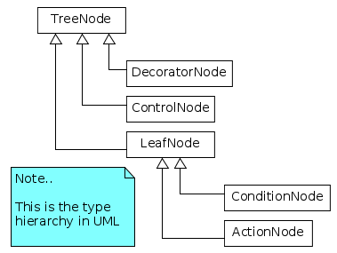
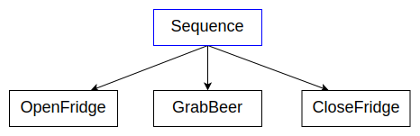
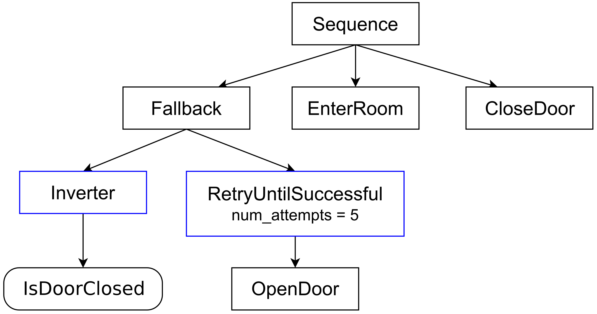
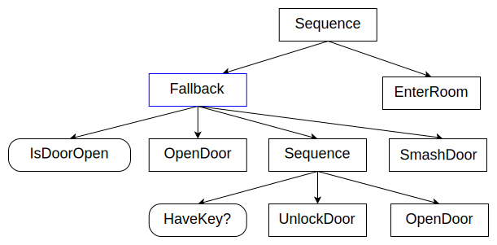
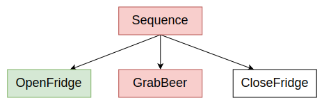
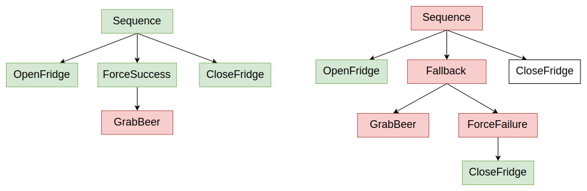
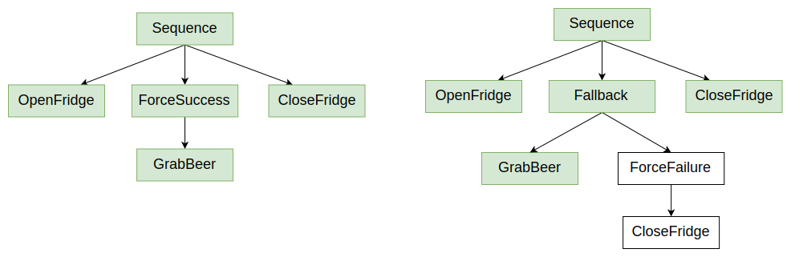

# 行为树介绍

与有限状态机不同，行为树是控制"任务"执行流的__分层节点树__。

## 基本概念

- 称为"__触发__"的信号被发送到树的根部，并通过树传播，直到到达叶节点。

- 任何接收__触发__信号的TreeNode执行其回调。此回调必须返回以下之一：

    - **SUCCESS**
    - **FAILURE**
    - **RUNNING**

- RUNNING意味着动作需要更多时间才能返回有效结果。

- 如果TreeNode有一个或多个子节点，它负责传播触发信号；每个节点类型可能有不同的规则，关于是否、何时以及多少次触发子节点。

 - __叶节点__，那些没有任何子节点的TreeNode，是实际的命令，即行为树与系统其余部分交互的节点。__动作__节点是最常见的叶节点类型。

:::tip
单词__触发__将经常用作*动词*（触发/被触发），意思是：

    "调用`TreeNode`的回调`tick()`"。
:::

在面向服务的架构中，叶节点将包含与"服务器"通信的"客户端"代码，服务器执行实际的操作。

## 触发如何工作

要在脑海中可视化触发树的工作原理，请考虑下面的示例。

__序列__是最简单的__控制节点__：它一个接一个地执行其子节点，如果它们全部成功，它也返回SUCCESS。

1. 第一次触发将Sequence节点设置为RUNNING（橙色）。
2. Sequence触发第一个子节点"OpenDoor"，最终返回SUCCESS。
3. 结果，第二个子节点"Walk"以及后来的"CloseDoor"被触发。
4. 一旦最后一个子节点完成，整个Sequence从RUNNING切换到SUCCESS。

## 节点类型

| TreeNode类型  | 子节点数量     | 说明              |
| -----------       | ------------------ | ------------------ |
| ControlNode       | 1...N | 通常，根据其兄弟节点的结果和/或其自身状态触发子节点。        |
| DecoratorNode     | 1     | 除其他外，它可能改变其子节点的结果或多次触发它。
| ConditionNode     | 0     | 不应改变系统。不应返回RUNNING。 |
| ActionNode        | 0     | 这是"做某事"的节点   |

在__动作节点__的上下文中，我们可以进一步区分同步和异步节点。

前者原子地执行并阻塞树，直到返回SUCCESS或FAILURE。

相反，异步动作可能返回RUNNING以表示动作仍在执行中。

我们需要再次触发它们，直到最终返回SUCCESS或FAILURE。

# 示例

为了更好地理解行为树如何工作，让我们关注一些实际示例。为简单起见，我们不考虑动作返回RUNNING时发生的情况。

我们将假设每个动作原子地且同步地执行。

### 第一个控制节点：序列

让我们使用最基本和最常用的控制节点：[SequenceNode](nodes-library/SequenceNode.md)来说明BT的工作原理。

控制节点的子节点总是__有序的__；在图形表示中，执行顺序是__从左到右__。

简而言之：

- 如果子节点返回SUCCESS，触发下一个。
- 如果子节点返回FAILURE，则不再触发更多子节点，Sequence返回FAILURE。
- 如果__所有__子节点返回SUCCESS，那么Sequence也返回SUCCESS。

:::caution 找出BUG！

如果动作__GrabBeer__失败，冰箱的门将保持打开状态，因为最后一个动作__CloseFridge__被跳过。
:::

### 装饰器

根据[DecoratorNode](nodes-library/DecoratorNode.md)的类型，此节点的目标可能是：

- 转换从子节点接收的结果。
- 中止子节点的执行。
- 根据装饰器类型重复触发子节点。

节点__Inverter__是一个装饰器，它反转其子节点返回的结果；因此，后跟节点__isDoorClosed__的Inverter等同于

    "门是开着的吗？"。

节点__Retry__将在子节点返回FAILURE时重复触发子节点最多__num_attempts__次（本例中为5次）。

__表面上__，左侧的分支意味着：

    如果门是关着的，那么尝试打开它。
    最多尝试5次，否则放弃并返回FAILURE。
    
但是...
    
:::caution 找出BUG！
如果__isDoorOpen__返回FAILURE，我们有所期望的行为。但如果它返回SUCCESS，左侧分支失败，整个序列被中断。
:::
    

### 第二个控制节点：回退

[FallbackNodes](nodes-library/FallbackNode.md)，也称为__"选择器"__，是可以表达回退策略的节点，即如果子节点返回FAILURE，接下来做什么。

它按顺序触发子节点：

- 如果子节点返回FAILURE，触发下一个。
- 如果子节点返回SUCCESS，则不再触发更多子节点，回退节点返回SUCCESS。
- 如果所有子节点返回FAILURE，那么回退节点也返回FAILURE。

在下一个示例中，你可以看到如何组合序列和回退：
    
  

> 门是开着的吗？
>
> 如果不是，尝试开门。
>
> 否则，如果你有钥匙，解锁并开门。
>
> 否则，砸门。
>
> 如果__任何__这些动作成功，那么进入房间。

### "给我拿啤酒"修订版

我们现在可以改进"给我拿啤酒"的示例，如果啤酒不在冰箱里，它会留下门开着。

我们使用颜色"绿色"表示返回SUCCESS的节点，"红色"表示返回FAILURE的节点。黑色节点尚未执行。

让我们创建一个替代树，即使__GrabBeer__返回FAILURE也会关门。

这两棵树最终都会关闭冰箱门，但是：

- __左侧__的树将始终返回SUCCESS，无论我们是否实际拿到了啤酒。
 
- __右侧__的树将在啤酒存在时返回SUCCESS，否则返回FAILURE。

如果__GrabBeer__返回SUCCESS，一切按预期工作。

