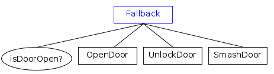
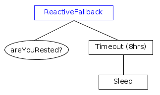

# 回退节点（控制节点）

这个节点家族在其他框架中被称为"选择器"或"优先级"。

它们的目的是尝试不同的策略，直到找到一个"有效"的策略。

目前框架提供三种类型的节点：

- Fallback
- AsyncFallback
- ReactiveFallback

它们共享以下规则：

- 在触发第一个子节点之前，节点状态变为__RUNNING__。

- 如果子节点返回__FAILURE__，回退节点触发下一个子节点。

- 如果__最后一个__子节点也返回__FAILURE__，所有子节点被中止，回退节点返回__FAILURE__。

- 如果子节点返回__SUCCESS__，它停止并返回__SUCCESS__。所有子节点被中止。

### 同步 vs 异步

`Fallback`和`AsyncFallback`共享相同的逻辑，但在处理子节点之间的转换方式上不同：

- **Fallback**在树的单次触发中触发所有子节点。当子节点返回FAILURE时，下一个子节点在同一调用中立即触发。
- **AsyncFallback**在每个子节点失败后将执行权交还给树，返回RUNNING并发出唤醒信号。这使得回退节点在子节点之间**可中断**，允许树的其他部分（例如，ReactiveSequence父节点）在下一个子节点开始之前重新评估条件。

### 比较表

要理解三种ControlNode的不同之处，请参考下表：

| ControlNode类型 | 子节点返回RUNNING | 在子节点之间让出 |
|---|:---:|:---:|
| Fallback | 再次触发  | 否 |
| AsyncFallback | 再次触发 | 是 |
| ReactiveFallback  |  重新开始 | 否 |

- "__重新开始__"意味着整个回退节点从列表的第一个子节点重新开始。

- "__再次触发__"意味着下次回退节点被触发时，再次触发相同的子节点。先前已经返回FAILURE的兄弟节点不会再次触发。

> 有关内置节点的完整列表，请参见本节的其他页面和Github上的[源代码](https://github.com/BehaviorTree/BehaviorTree.CPP/tree/master/include/behaviortree_cpp)。

## Fallback

在这个示例中，我们尝试不同的策略来开门。首先（且仅一次）检查门是否开着。



## AsyncFallback

AsyncFallback的行为类似于Fallback，但在每个子节点返回FAILURE后**让出执行权**给树。它返回RUNNING并发出唤醒信号，允许响应式父节点在下一个子节点被触发之前重新评估条件。

```xml
<ReactiveSequence>
    <IsRobotHungry/>
    <AsyncFallback>
        <FindFoodInBackpack/>
        <FindNearbyRestaurant/>
        <OrderFoodDelivery/>
    </AsyncFallback>
</ReactiveSequence>
```

在这个示例中，`IsRobotHungry`在AsyncFallback的每次尝试之间重新检查。如果机器人在`FindFoodInBackpack`失败后不再饥饿，回退节点在`FindNearbyRestaurant`开始之前被中断。

## ReactiveFallback

当我们想要中断__异步__子节点，如果先前的条件之一将其状态从FAILURE更改为SUCCESS时，使用此ControlNode。

在以下示例中，角色将睡眠*最多*8小时。如果他/她完全休息了，那么节点`areYouRested?`将返回SUCCESS，异步节点`Timeout (8 hrs)`和`Sleep`将被中断。

