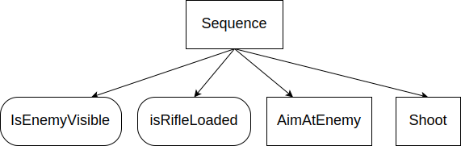
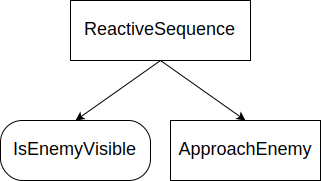

# 序列节点

__序列__ 触发其所有子节点，只要它们返回SUCCESS。如果任何子节点返回FAILURE，序列被中止。

目前框架提供四种类型的节点：

- Sequence
- AsyncSequence
- SequenceWithMemory
- ReactiveSequence

它们共享以下规则：

- 在触发第一个子节点之前，节点状态变为 __RUNNING__ 。

- 如果子节点返回 __SUCCESS__ ，它触发下一个子节点。

- 如果 __最后一个__ 子节点也返回 __SUCCESS__ ，所有子节点被中止，序列返回 __SUCCESS__ 。

### 同步 vs 异步

`Sequence`和`AsyncSequence`共享相同的逻辑，但在处理子节点之间的转换方式上不同：

- **Sequence** 在树的单次触发中触发所有子节点。当子节点返回SUCCESS时，下一个子节点在同一调用中立即触发。
- **AsyncSequence** 在每个子节点成功后将执行权交还给树，返回RUNNING并发出唤醒信号。这使得序列在子节点之间 **可中断** ，允许树的其他部分（例如，ReactiveSequence父节点）在下一个子节点开始之前重新评估条件。

当序列在响应式父节点内部且需要在每个步骤之间重新检查条件时，使用`AsyncSequence`。

### 比较表

要理解四种ControlNode的不同之处，请参考下表：

| ControlNode类型 | 子节点返回FAILURE  |  子节点返回RUNNING | 在子节点之间让出 |
|---|:---:|:---:|:---:|
| Sequence | 重新开始  | 再次触发  | 否 |
| AsyncSequence | 重新开始 | 再次触发 | 是 |
| ReactiveSequence  | 重新开始  |  重新开始 | 否 |
| SequenceWithMemory | 再次触发  | 再次触发  | 否 |

- " __重新开始__ "意味着整个序列从列表的第一个子节点重新开始。

- " __再次触发__ "意味着下次序列被触发时，再次触发相同的子节点。先前已经返回SUCCESS的兄弟节点不会再次触发。

> 有关内置节点的完整列表，请参见本节的其他页面和Github上的[源代码](https://github.com/BehaviorTree/BehaviorTree.CPP/tree/master/include/behaviortree_cpp)。

## Sequence

这棵树代表了计算机游戏中狙击手的行为。



## AsyncSequence

AsyncSequence的行为类似于Sequence，但在每个子节点返回SUCCESS后 **让出执行权** 给树。它返回RUNNING并发出唤醒信号，允许响应式父节点在下一个子节点被触发之前重新评估条件。

```xml
<ReactiveSequence>
    <IsEnemyVisible/>
    <AsyncSequence>
        <AimWeapon/>
        <FireWeapon/>
        <ReloadWeapon/>
    </AsyncSequence>
</ReactiveSequence>
```

在这个示例中，`IsEnemyVisible`在AsyncSequence的每个步骤之间重新检查。如果敌人在`AimWeapon`成功后消失，序列在`FireWeapon`开始之前被中断。

## ReactiveSequence

这个节点特别适用于持续检查条件；但用户在使用异步子节点时也应小心，确保它们不会被触发得比预期更频繁。

让我们看另一个示例：



`ApproachEnemy`是一个__异步__动作，返回RUNNING直到最终完成。

__同步__条件`isEnemyVisible`将被调用多次并快速返回true或false。如果它变为false（即"FAILURE"），`ApproachEnemy`被中止。

## SequenceWithMemory

当你不想再次触发已经返回SUCCESS的子节点时，使用此ControlNode。

__示例__ ：

这是一个巡逻代理/机器人，必须 __只一次__ 访问位置A、B和C。如果动作 __GoTo(B)__ 失败， __GoTo(A)__ 将不会再次触发。

另一方面，__isBatteryOK__必须在每次触发时检查，因此其父节点必须是`ReactiveSequence`。

