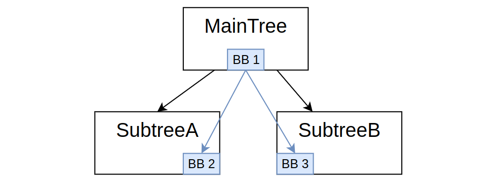

# 为什么需要"全局黑板"

:::note
在Bt.CPP 4.6.0中引入
:::

如早期教程所述，BT.CPP坚持拥有"作用域黑板"的重要性，以将每个子树隔离为独立的函数/例程，就像在编程语言中一样。

尽管如此，在某些情况下，可能希望拥有一个真正的"全局"黑板，可以直接从每个子树访问，而无需重映射。

这在以下情况下有意义：

- 单例和全局对象，无法按照[教程8](tutorial-basics/tutorial_08_additional_args.md)中描述的方式共享
- 机器人的全局状态。
- 在行为树外部写入/读取的数据，即在执行触发的主循环中。

此外，由于黑板是一个通用的键/值存储，其中值可以包含**任何**类型，它是实现文献中称为**"世界模型"**的完美数据结构，即一个可以与行为树共享环境状态、机器人状态和任务状态的地方。

## 黑板层次结构

考虑一个具有两个子树的简单树，如下所示：



3个子树中的每一个都有自己的黑板；这些黑板之间的父/子关系与树完全相同，即BB1是BB2和BB3的父级。

这些单独黑板的生命周期与其各自的子树耦合。

我们可以像这样实现外部"全局黑板"：

```cpp
auto global_bb = BT::Blackboard::create();
auto maintree_bb = BT::Blackboard::create(global_bb);
auto tree = factory.createTree("MainTree", maintree_bb);
```

这将创建以下黑板层次结构：


实例`global_bb`存在于行为树"外部"，如果对象`tree`被销毁，它将持续存在。

此外，可以使用`set`和`get`方法轻松访问它。

## 如何从树中访问顶层黑板

"顶层黑板"指的是层次结构根部的黑板。

在上面的代码中，`global_bb`成为顶层黑板。

自BT.CPP**4.6**版本起，引入了一种新语法，通过为条目名称添加前缀`@`来**无需重映射**地访问顶层黑板。

例如：

```xml
<PrintNumber val="{@value}" />
```

端口**val**将在顶层黑板中搜索条目`value`，而不是在本地黑板中。

## 完整示例

考虑这棵树：

```xml
  <BehaviorTree ID="MainTree">
    <Sequence>
      <PrintNumber name="main_print" val="{@value}" />
      <SubTree ID="MySub"/>
    </Sequence>
  </BehaviorTree>

  <BehaviorTree ID="MySub">
    <Sequence>
      <PrintNumber name="sub_print" val="{@value}" />
      <Script code="@value_sqr := @value * @value" />
    </Sequence>
  </BehaviorTree>
```

以及C++代码：

```cpp
class PrintNumber : public BT::SyncActionNode
{
public:
  PrintNumber(const std::string& name, const BT::NodeConfig& config)
    : BT::SyncActionNode(name, config)
  {}
  
  static BT::PortsList providedPorts()
  {
    return { BT::InputPort<int>("val") };
  }

  NodeStatus tick() override
  {
    const int val = getInput<int>("val").value();
    std::cout << "[" << name() << "] val: " << val << std::endl;
    return NodeStatus::SUCCESS;
  }
};

int main()
{
  BehaviorTreeFactory factory;
  factory.registerNodeType<PrintNumber>("PrintNumber");
  factory.registerBehaviorTreeFromText(xml_main);

  // 没有人将拥有这个黑板的所有权
  auto global_bb = BT::Blackboard::create();
  // "MainTree"将拥有maintree_bb
  auto maintree_bb = BT::Blackboard::create(global_bb);
  auto tree = factory.createTree("MainTree", maintree_bb);

  // 我们可以直接与global_bb交互
  for(int i = 1; i <= 3; i++)
  {
    // 写入条目"value"
    global_bb->set("value", i);
    // 触发树
    tree.tickOnce();
    // 读取条目"value_sqr"
    auto value_sqr = global_bb->get<int>("value_sqr");
    // 打印
    std::cout << "[While loop] value: " << i 
              << " value_sqr: " << value_sqr << "\n\n";
  }
  return 0;
}
```

输出：
```
[main_print] val: 1
[sub_print] val: 1
[While loop] value: 1 value_sqr: 1

[main_print] val: 2
[sub_print] val: 2
[While loop] value: 2 value_sqr: 4

[main_print] val: 3
[sub_print] val: 3
[While loop] value: 3 value_sqr: 9
```

注意：

- 前缀"@"在输入/输出端口或脚本语言中使用时都有效。
- 子树中不需要重映射。
- 在主循环中直接访问黑板时，不需要前缀"@"。