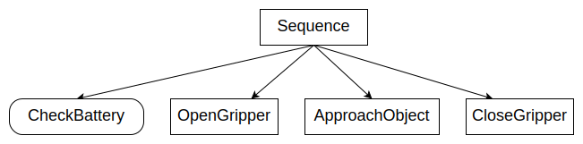

# 你的第一个行为树

行为树（Behavior Trees）与状态机类似，本质上是一种在正确时间和条件下调用 __回调函数__ 的机制。
这些回调函数内部发生什么完全由你决定。

我们将交替使用 __"to invoke the callback"__ 和 __"tick"__ 这两个表达方式。

在本教程系列中，大多数时候我们的假动作（dummy Actions）只是简单地在控制台打印一些信息，
但请记住，真实的"生产"代码可能会做更复杂的事情。

此外，我们将创建这个简单的树：



## 如何创建你自己的动作节点（ActionNodes）

创建树节点（TreeNode）的默认（也是推荐）方式是通过继承。

``` cpp
// 自定义同步动作节点（SyncActionNode）的示例
// 不带端口。
class ApproachObject : public BT::SyncActionNode
{
public:
  ApproachObject(const std::string& name) :
      BT::SyncActionNode(name, {})
  {}

  // 你必须重写虚函数 tick()
  BT::NodeStatus tick() override
  {
    std::cout << "ApproachObject: " << this->name() << std::endl;
    return BT::NodeStatus::SUCCESS;
  }
};
``` 

如你所见：

- 任何树节点实例都有一个`name`。这个标识符应该是人类可读的，并且 __不需要__ 唯一。
 
- __tick()__ 方法是实际动作发生的地方。它必须始终返回一个`NodeStatus`，即RUNNING、SUCCESS或FAILURE。

或者，我们可以使用 __依赖注入__ 来根据函数指针（即"函数对象"）创建树节点。

函数对象必须具有以下签名：

``` cpp
BT::NodeStatus myFunction(BT::TreeNode& self) 
```

例如：

``` cpp
using namespace BT;

// 返回NodeStatus的简单函数
BT::NodeStatus CheckBattery()
{
  std::cout << "[ Battery: OK ]" << std::endl;
  return BT::NodeStatus::SUCCESS;
}

// 我们想要将open()和close()方法包装到动作节点中
class GripperInterface
{
public:
  GripperInterface(): _open(true) {}
    
  NodeStatus open() 
  {
	_open = true;
	std::cout << "GripperInterface::open" << std::endl;
	return NodeStatus::SUCCESS;
  }

  NodeStatus close() 
  {
    std::cout << "GripperInterface::close" << std::endl;
	_open = false;
	return NodeStatus::SUCCESS;
  }

private:
  bool _open; // 共享信息
};

``` 

我们可以从以下任何函数对象构建`SimpleActionNode`：

- CheckBattery()
- GripperInterface::open()
- GripperInterface::close()

**注意**：`GripperInterface::open()` 和 `GripperInterface::close()` 的签名是 `NodeStatus open()` 和 `NodeStatus close()`，而 `SimpleActionNode` 要求的签名是 `BT::NodeStatus myFunction(BT::TreeNode& self)`。它们不匹配！我们需要使用 **std::bind** 或 **lambda 表达式** 来进行适配：

```cpp
// 用 lambda 表达式创建适配器，忽略 TreeNode 参数
auto open_func = [&gripper](BT::TreeNode& self) {
    return gripper.open();  // 忽略 self 参数
};
```

这种设计模式叫做 **适配器模式**：通过 lambda 或 bind 创建一个适配器，使签名匹配，既满足了行为树框架的接口要求，又不需要修改原有的业务代码。

## 使用XML动态创建树

让我们考虑名为 __my_tree.xml__ 的以下XML文件：

``` xml
 <root BTCPP_format="4" >
     <BehaviorTree ID="MainTree">
        <Sequence name="root_sequence">
            <CheckBattery   name="check_battery"/>
            <OpenGripper    name="open_gripper"/>
            <ApproachObject name="approach_object"/>
            <CloseGripper   name="close_gripper"/>
        </Sequence>
     </BehaviorTree>
 </root>
```

> [!TIP]
> 你可以在[这里](learn-the-basics/xml_format.md)找到关于XML模式的更多细节。


我们必须首先将自定义的树节点注册到`BehaviorTreeFactory`中，然后从文件或文本加载XML。

XML中使用的标识符必须与注册树节点时使用的标识符一致。

属性"name"表示实例的名称； **它是可选的** 。

``` cpp
#include "behaviortree_cpp/bt_factory.h"

// 包含自定义节点定义的文件
#include "dummy_nodes.h"
using namespace DummyNodes;

int main()
{
    // 我们使用BehaviorTreeFactory来注册我们的自定义节点
  BehaviorTreeFactory factory;

  // 推荐的方式是通过继承创建节点。
  factory.registerNodeType<ApproachObject>("ApproachObject");

  // 使用函数指针注册SimpleActionNode。
  // 你可以使用C++11 lambda表达式或std::bind
  factory.registerSimpleCondition("CheckBattery", [&](TreeNode&) { return CheckBattery(); });

  // 你也可以使用类的方法创建SimpleActionNodes
  GripperInterface gripper;
  factory.registerSimpleAction("OpenGripper", [&](TreeNode&){ return gripper.open(); } );
  factory.registerSimpleAction("CloseGripper", [&](TreeNode&){ return gripper.close(); } );

  // 树在部署时创建（即在运行时，但只在开始时创建一次）。 
    
  // 重要：当对象"tree"超出作用域时，所有树节点都会被销毁
   auto tree = factory.createTreeFromFile("./my_tree.xml");

  // 要"执行"一棵树，你需要"触发"它。
  // 触发信号根据树的逻辑传播到子节点。
  // 在这种情况下，整个序列都会被执行，因为Sequence的所有子节点都返回SUCCESS。
  tree.tickWhileRunning();

  return 0;
}

/* 预期输出：
*
  [ Battery: OK ]
  GripperInterface::open
  ApproachObject: approach_object
  GripperInterface::close
*/

``` 


