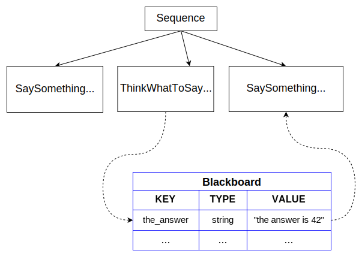

# 黑板与端口

正如我们之前解释的，自定义树节点（TreeNodes）可用于执行任意简单或复杂的软件片段。它们的目标是提供具有 __更高抽象级别__ 的接口。

因此，它们在概念上与 __函数__ 没有区别。

与函数类似，我们经常希望：

 - 向节点传递参数（ __输入__ ）
 - 从节点获取某种信息（ __输出__ ）
 - 一个节点的输出可以是另一个节点的输入

BehaviorTree.CPP通过 __端口__ 提供了一种基本的 __数据流__ 机制，既简单易用又灵活且类型安全。

在本教程中，我们将创建以下树：



> [!TIP]
> 主要概念
> - "黑板"（Blackboard）是一个简单的 __键/值存储__ ，由树的所有节点共享。
> - 黑板的一个"条目"是一个 __键/值对__ 。
> - __输入端口__ 可以读取黑板中的条目，而 __输出端口__ 可以向条目写入数据。

## 输入端口

有效的输入可以是：

- 节点将读取和解析的 __静态字符串__ ，或者
- 指向黑板条目的"指针"，由 __键__ 标识。

假设我们想要创建一个名为`SaySomething`的动作节点（ActionNode），它应该在`std::cout`上打印给定的字符串。

为了传递这个字符串，我们将使用一个名为 __message__ 的输入端口。

考虑这些替代的XML语法：

``` xml
<SaySomething name="first"   message="hello world" />
<SaySomething name="second" message="{greetings}" />
```

- 在 __第一个__ 节点中，端口接收字符串"hello world"；
- __第二个__ 节点则被要求使用条目"greetings"在黑板上查找值。

> [!CAUTION]
> 条目"greetings"的值可以（并且很可能）在运行时改变。


动作节点`SaySomething`可以如下实现：

``` cpp
// 带有输入端口的同步动作节点（SyncActionNode）。
class SaySomething : public SyncActionNode
{
public:
  // 如果你的节点有端口，必须使用这个构造函数签名
  SaySomething(const std::string& name, const NodeConfig& config)
    : SyncActionNode(name, config)
  { }

  // 必须定义这个STATIC方法。
  static PortsList providedPorts()
  {
    // 这个动作有一个名为"message"的输入端口
    return { InputPort<std::string>("message") };
  }

  // 重写虚函数 tick()
  NodeStatus tick() override
  {
    Expected<std::string> msg = getInput<std::string>("message");
    // 检查expected是否有效。如果无效，抛出其错误
    if (!msg)
    {
      throw BT::RuntimeError("missing required input [message]: ", 
                              msg.error() );
    }
    // 使用value()方法提取有效的消息。
    std::cout << "Robot says: " << msg.value() << std::endl;
    return NodeStatus::SUCCESS;
  }
};
```

当自定义树节点有输入和/或输出端口时，这些端口必须在 __静态__ 方法中声明：

``` cpp
static MyCustomNode::PortsList providedPorts();
```

可以使用模板方法`TreeNode::getInput<T>(key)`读取端口`message`的输入。

这个方法可能因多种原因失败。由用户检查返回值的有效性并决定如何处理：

- 返回`NodeStatus::FAILURE`？
- 抛出异常？
- 使用不同的默认值？

> [!CAUTION]
> 重要
> __始终__建议在`tick()`内部调用`getInput()`方法，而__不是__在类的构造函数中。
>
> C++代码应该期望输入的实际值 __在运行时改变__ ，因此应该定期更新。


## 输出端口

指向黑板条目的输入端口只有在另一个节点已经向同一条目写入"某些内容"时才有效。

`ThinkWhatToSay`是一个使用__输出端口__向条目写入字符串的节点示例。

``` cpp
class ThinkWhatToSay : public SyncActionNode
{
public:
  ThinkWhatToSay(const std::string& name, const NodeConfig& config)
    : SyncActionNode(name, config)
  { }

  static PortsList providedPorts()
  {
    return { OutputPort<std::string>("text") };
  }

  // 这个动作向端口"text"写入一个值
  NodeStatus tick() override
  {
    // 输出可能在每次tick()时改变。这里我们保持简单。
    setOutput("text", "The answer is 42" );
    return NodeStatus::SUCCESS;
  }
};
```

或者，大多数情况下为了调试目的，可以使用名为`Script`的内置动作向条目写入静态值。

``` xml
<Script code=" the_answer:='The answer is 42' " />
```

我们将在关于[BT.CPP中的新脚本语言](guides/scripting.md)的教程中更多地讨论动作 __Script__ 。

> [!TIP]
> 如果你正在从BT.CPP 3.X迁移， __Script__ 是 __SetBlackboard__ 的直接替代品，后者现在已不推荐使用。


## 双向端口

有时节点需要 **读取和修改** 黑板上的值。对于这些情况，使用`BidirectionalPort<T>`，它结合了InputPort和OutputPort的功能。

``` cpp
static PortsList providedPorts()
{
    return { BidirectionalPort<std::vector<int>>("vector"),
             InputPort<int>("value") };
}
```

双向端口通常与`getLockedPortContent()`一起使用，用于对黑板条目进行线程安全的读取-修改-写入访问。
有关完整解释和示例，请参见[教程13：通过引用访问端口](../tutorial-advanced/tutorial_13_blackboard_reference.md)。

## 完整示例

在这个示例中，执行了一个包含3个动作的序列：

- 动作1从静态字符串读取输入`message`。

- 动作2向名为`the_answer`的黑板条目写入内容。

- 动作3从名为`the_answer`的黑板条目读取输入`message`。

``` xml
<root BTCPP_format="4" >
    <BehaviorTree ID="MainTree">
       <Sequence name="root_sequence">
           <SaySomething     message="hello" />
           <ThinkWhatToSay   text="{the_answer}"/>
           <SaySomething     message="{the_answer}" />
       </Sequence>
    </BehaviorTree>
</root>
```

注册和执行树的C++代码：

``` cpp
#include "behaviortree_cpp/bt_factory.h"

// 包含自定义节点定义的文件
#include "dummy_nodes.h"
using namespace DummyNodes;

int main()
{  
  BehaviorTreeFactory factory;
  factory.registerNodeType<SaySomething>("SaySomething");
  factory.registerNodeType<ThinkWhatToSay>("ThinkWhatToSay");

  auto tree = factory.createTreeFromFile("./my_tree.xml");
  tree.tickWhileRunning();
  return 0;
}

/* 预期输出：
  Robot says: hello
  Robot says: The answer is 42
*/
```

我们使用相同的键（`the_answer`）将输出端口"连接"到输入端口；换句话说，它们"指向"黑板的同一个条目。

这些端口可以相互连接，因为它们具有相同的类型，即`std::string`。如果你尝试连接类型不同的端口，方法`factory.createTreeFromFile`将抛出异常。


