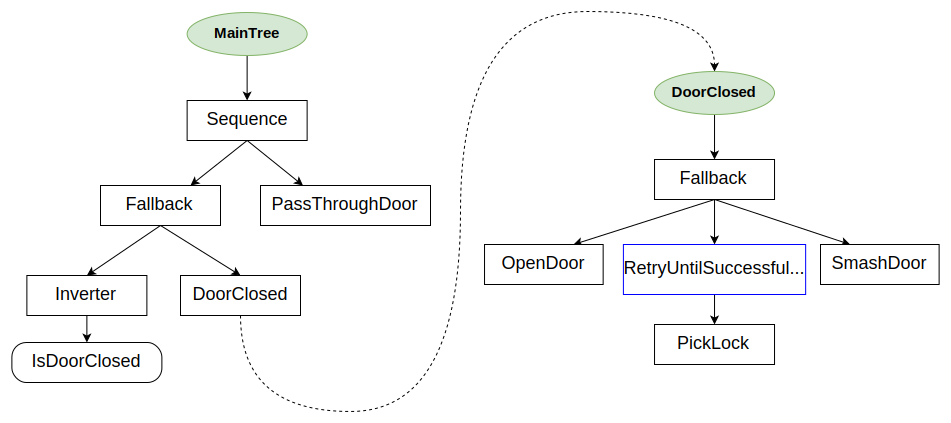

# 使用子树组合行为

我们可以通过将较小且可重用的行为插入到较大的行为中来构建大规模行为。

换句话说，我们想要创建 __层次化__ 的行为树，并使我们的树 __可组合__ 。

这可以通过在XML中定义多个树并使用 __SubTree__ 节点将一个树包含到另一个树中来实现。

# CrossDoor行为

这个示例灵感来源于一篇关于行为树的[流行文章](https://www.gamedeveloper.com/programming/behavior-trees-for-ai-how-they-work)。

它也是第一个使用`Decorators`和`Fallback`的实际示例。



``` xml
<root BTCPP_format="4">

    <BehaviorTree ID="MainTree">
        <Sequence>
            <Fallback>
                <Inverter>
                    <IsDoorClosed/>
                </Inverter>
                // highlight-next-line
                <SubTree ID="DoorClosed"/>
            </Fallback>
            <PassThroughDoor/>
        </Sequence>
    </BehaviorTree>

    <BehaviorTree ID="DoorClosed">
        <Fallback>
            <OpenDoor/>
            <RetryUntilSuccessful num_attempts="5">
                <PickLock/>
            </RetryUntilSuccessful>
            <SmashDoor/>
        </Fallback>
    </BehaviorTree>
    
</root>
```

期望的行为是：

- 如果门是开的，执行`PassThroughDoor`。
- 如果门是关的，尝试`OpenDoor`，或者
尝试`PickLock`最多5次，或者最后，`SmashDoor`。
- 如果`DoorClosed`子树中的至少一个动作成功，
那么执行`PassThroughDoor`。

## CPP代码

我们不会展示`CrossDoor`中虚拟动作的详细实现。

唯一有趣的代码可能是`registerNodes`。

``` cpp

class CrossDoor
{
public:
    void registerNodes(BT::BehaviorTreeFactory& factory);

    // 如果_door_open != true，返回SUCCESS
    BT::NodeStatus isDoorClosed();

    // 如果_door_open == true，返回SUCCESS
    BT::NodeStatus passThroughDoor();

    // 3次尝试后，将打开锁着的门
    BT::NodeStatus pickLock();

    // 如果门锁着，返回FAILURE
    BT::NodeStatus openDoor();

    // 总是会打开门
    BT::NodeStatus smashDoor();

private:
    bool _door_open   = false;
    bool _door_locked = true;
    int _pick_attempts = 0;
};

// 辅助方法，使用户注册更轻松
void CrossDoor::registerNodes(BT::BehaviorTreeFactory &factory)
{
  factory.registerSimpleCondition(
      "IsDoorClosed", std::bind(&CrossDoor::isDoorClosed, this));

  factory.registerSimpleAction(
      "PassThroughDoor", std::bind(&CrossDoor::passThroughDoor, this));

  factory.registerSimpleAction(
      "OpenDoor", std::bind(&CrossDoor::openDoor, this));

  factory.registerSimpleAction(
      "PickLock", std::bind(&CrossDoor::pickLock, this));

  factory.registerSimpleCondition(
      "SmashDoor", std::bind(&CrossDoor::smashDoor, this));
}

int main()
{
  BehaviorTreeFactory factory;

  CrossDoor cross_door;
  cross_door.registerNodes(factory);

  // 在这个示例中，单个XML包含多个<BehaviorTree>
  // 要确定哪个是"主树"，我们应该先注册
  // XML，然后使用其ID分配特定的树

  factory.registerBehaviorTreeFromText(xml_text);
  auto tree = factory.createTree("MainTree");

  // 辅助函数，用于打印树
  printTreeRecursively(tree.rootNode());

  tree.tickWhileRunning();

  return 0;
}

```