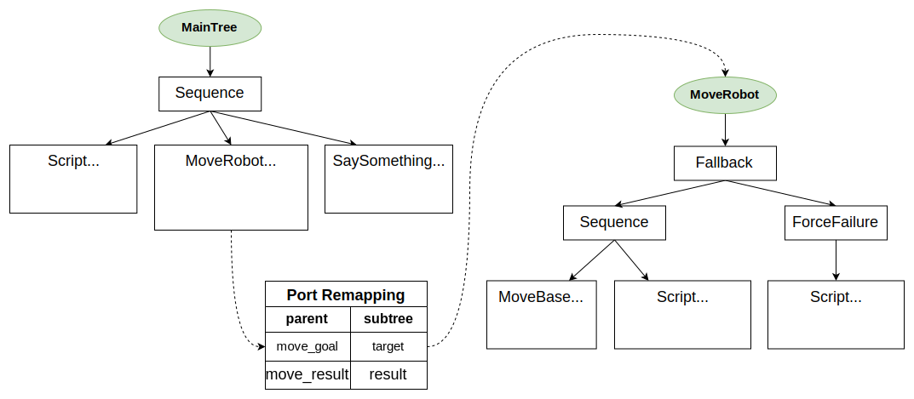

# 重映射子树的端口

在CrossDoor示例中，我们看到从父树的角度来看，`SubTree`看起来像一个单独的叶节点。

为了避免在非常大的树中出现名称冲突，任何树和子树都使用不同的黑板实例。

因此，我们需要显式地将树的端口连接到其子树的端口。

你 __不需要__ 修改你的C++实现，因为这种重映射完全在XML定义中完成。

## 示例

让我们考虑这个行为树。



``` xml
<root BTCPP_format="4">

    <BehaviorTree ID="MainTree">
        <Sequence>
            <Script code=" move_goal='1;2;3' " />
            // highlight-start
            <SubTree ID="MoveRobot" target="{move_goal}" 
                                    result="{move_result}" />
            // highlight-end
            <SaySomething message="{move_result}"/>
        </Sequence>
    </BehaviorTree>

    <BehaviorTree ID="MoveRobot">
        <Fallback>
            <Sequence>
                <MoveBase  goal="{target}"/>
                <Script code=" result:='goal reached' " />
            </Sequence>
            <ForceFailure>
                <Script code=" result:='error' " />
            </ForceFailure>
        </Fallback>
    </BehaviorTree>

</root>
```

你可能注意到：

- 我们有一个`MainTree`，它包含一个名为`MoveRobot`的子树。
- 我们想要"连接"（即"重映射"）`MoveRobot`子树内部的端口与`MainTree`中的其他端口。
- 这是通过上面示例中使用的语法完成的。

# CPP代码

这里不需要做太多。我们使用`debugMessage`方法来检查黑板的值。

``` cpp
int main()
{
  BT::BehaviorTreeFactory factory;

  factory.registerNodeType<SaySomething>("SaySomething");
  factory.registerNodeType<MoveBaseAction>("MoveBase");

  factory.registerBehaviorTreeFromText(xml_text);
  auto tree = factory.createTree("MainTree");

  // 持续触发直到结束
  tree.tickWhileRunning();

  // 让我们可视化一些关于黑板当前状态的信息。
  std::cout << "\n------ First BB ------" << std::endl;
  tree.subtrees[0]->blackboard->debugMessage();
  std::cout << "\n------ Second BB------" << std::endl;
  tree.subtrees[1]->blackboard->debugMessage();

  return 0;
}

/* 预期输出：

------ First BB ------
move_result (std::string)
move_goal (Pose2D)

------ Second BB------
[result] 重映射到父树的端口 [move_result]
[target] 重映射到父树的端口 [move_goal]

*/
```