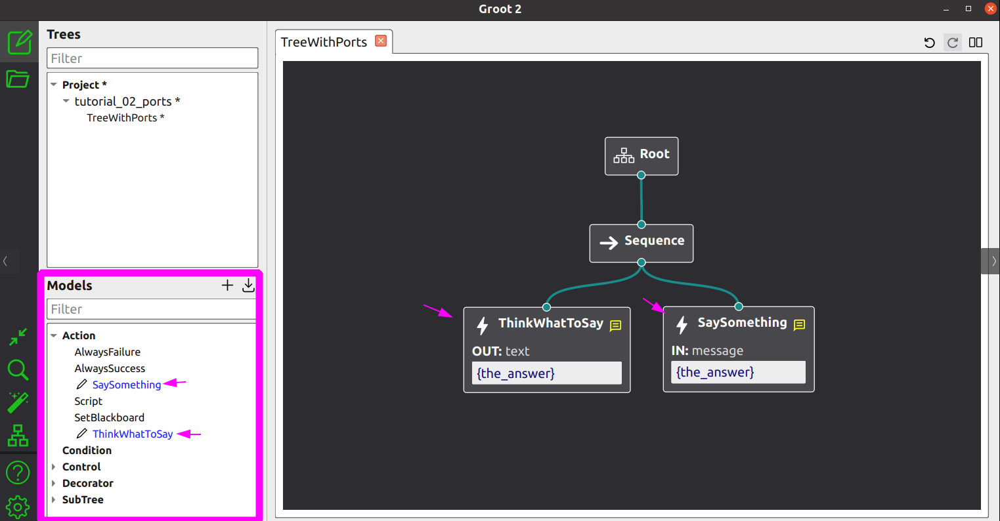

**Groot2** 是用于编辑、监控和与使用 **BT.CPP** 创建的行为树交互的官方IDE。

集成两者非常容易，正如你将在本教程中看到的，但首先你应该理解一些简单的概念。

## TreeNodesModel

Groot需要一个"TreeNode模型"。



例如，在上面的图像中，Groot需要知道用户定义的节点`ThinkWhatToSay`和`SaySomething`存在。

此外，它需要：

- 节点类型
- 端口的名称和类型（输入/输出）。

这些模型以XML表示。在这种情况下，它们将是：

```xml
  <TreeNodesModel>
    <Action ID="SaySomething">
      <input_port name="message"/>
    </Action>
    <Action ID="ThinkWhatToSay">
      <output_port name="text"/>
    </Action>
  </TreeNodesModel>
```

然而， **你不应该手动创建这些XML描述** 。

BT.CPP有一个特定的函数将为你生成这个XML。

```cpp
  BT::BehaviorTreeFactory factory;
  //
  // 在这里注册你的用户定义节点
  // 
  std::string xml_models = BT::writeTreeNodesModelXML(factory);

  // 这个xml_models应该保存到文件并
  // 在Groot2中加载
```

要将这些模型导入到UI中，可以：

- 将XML保存到文件（例如`models.xml`），然后在Groot2中点击 **导入模型** 按钮。
- 或者手动将XML部分直接添加到你的`.xml`或`.btproj`文件中。

## 向Groot添加实时可视化

:::note
目前，只有Groot2的PRO版本支持实时可视化。
:::

将树连接到Groot2只需要一行代码：

```cpp
BT::Groot2Publisher publisher(tree);
```

这将在你的BT.CPP执行器和Groot2之间创建一个进程间通信服务，该服务：

- 将整个树结构发送到Groot2，包括上面提到的模型。
- 定期更新各个节点的状态（RUNNING、SUCCESS、FAILURE、IDLE）。
- 发送黑板的值；基本类型如整数、实数和字符串开箱即用，其他类型需要手动添加。
- 允许Groot2插入断点、执行节点替换或故障注入。

完整示例：

```xml
<root BTCPP_format="4">

  <BehaviorTree ID="MainTree">
    <Sequence>
      <Script code="door_open:=false" />
      <Fallback>
        <Inverter>
          <IsDoorClosed/>
        </Inverter>
        <SubTree ID="DoorClosed" _autoremap="true" door_open="{door_open}"/>
      </Fallback>
      <PassThroughDoor/>
    </Sequence>
  </BehaviorTree>

  <BehaviorTree ID="DoorClosed">
    <Fallback name="tryOpen" _onSuccess="door_open:=true">
      <OpenDoor/>
        <RetryUntilSuccessful num_attempts="5">
          <PickLock/>
        </RetryUntilSuccessful>
      <SmashDoor/>
    </Fallback>
  </BehaviorTree>

</root>
```

```cpp
int main()
{
  BT::BehaviorTreeFactory factory;

  // 我们与CrossDoor相关的一组简单节点
  CrossDoor cross_door;
  cross_door.registerNodes(factory);

  // Groot2编辑器需要你注册节点的模型。
  // 你不需要手动编写，可以使用以下命令
  // 自动生成。
  std::string xml_models = BT::writeTreeNodesModelXML(factory);

  factory.registerBehaviorTreeFromText(xml_text);
  auto tree = factory.createTree("MainTree");

  // 连接Groot2Publisher。这将允许Groot2
  // 获取树并轮询状态更新。
  BT::Groot2Publisher publisher(tree);

  // 我们希望无限期运行
  while(1)
  {
    std::cout << "Start" << std::endl;
    cross_door.reset();
    tree.tickWhileRunning();
    std::this_thread::sleep_for(std::chrono::milliseconds(3000));
  }
  return 0;
}
```

## 在黑板中可视化自定义类型

黑板中的内容使用JSON格式发送到Groot2。

基本类型（整数、实数、字符串）开箱即用。要允许Groot2可视化你自己的自定义类型，你需要包含 **behaviortree_cpp/json_export.h** 并定义一个JSON转换器。

### 使用BT_JSON_CONVERTER宏（推荐）

最简单的方法是使用`BT_JSON_CONVERTER`宏。给定一个用户定义的类型：

```cpp
struct Position2D
{
  double x;
  double y;
};
```

在文件作用域（任何函数之外）定义转换器：

```cpp
#include "behaviortree_cpp/json_export.h"

BT_JSON_CONVERTER(Position2D, pos)
{
  add_field("x", &pos.x);
  add_field("y", &pos.y);
}
```

这也适用于嵌套类型：

```cpp
struct Waypoint
{
  std::string name;
  Position2D position;
  double speed = 1.0;
};

BT_JSON_CONVERTER(Waypoint, wp)
{
  add_field("name", &wp.name);
  add_field("position", &wp.position);
  add_field("speed", &wp.speed);
}
```

然后，在你的 **main** 函数中注册这些类型（在创建树之前）：

```cpp
BT::RegisterJsonDefinition<Position2D>();
BT::RegisterJsonDefinition<Waypoint>();
```

完整示例请参见[t11_groot_howto.cpp](https://github.com/BehaviorTree/BehaviorTree.CPP/blob/master/examples/t11_groot_howto.cpp)。

### 手动转换器（替代方案）

如果你需要对JSON序列化进行更多控制，你可以编写一个签名为`void(nlohmann::json&, const T&)`的转换函数，并显式注册它：

```cpp
void PositionToJson(nlohmann::json& dest, const Position2D& pos) {
  dest["x"] = pos.x;
  dest["y"] = pos.y;
}

// 在main()中
BT::RegisterJsonDefinition<Position2D>(PositionToJson);
```